# SimpleMarket
Firebase 와 연동되는 안드로이드 예제 앱

# Firebase 연동하기


### 프로젝트 생성

Firebase 에서 프로젝트르 생성하고 Android 앱에 Firebase 추가를 합니다.

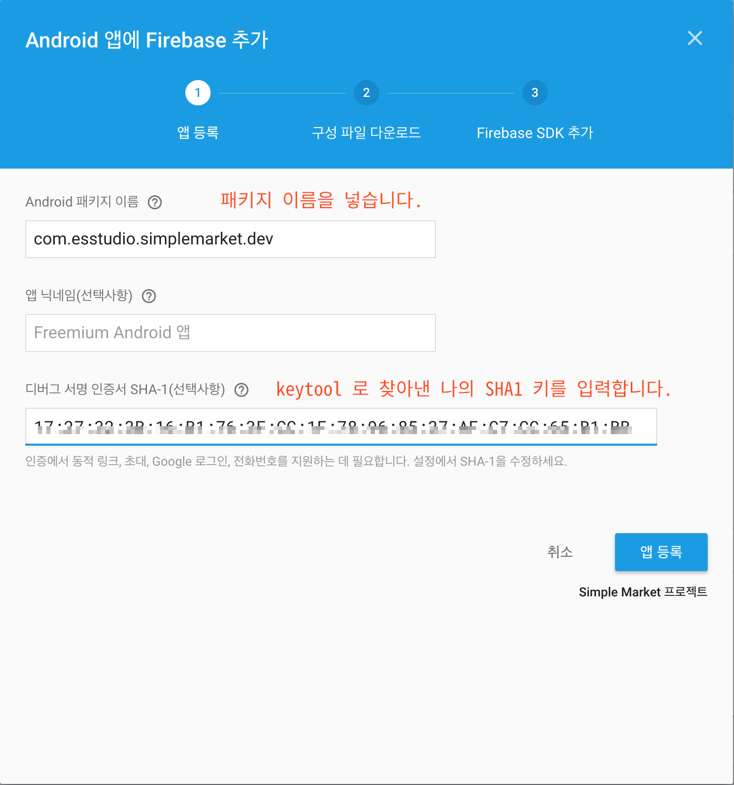

### 패키지 이름 찾기

IDE 왼쪽에 프로젝트 파일트리를 Android 형태의 보기로 바꿉니다.

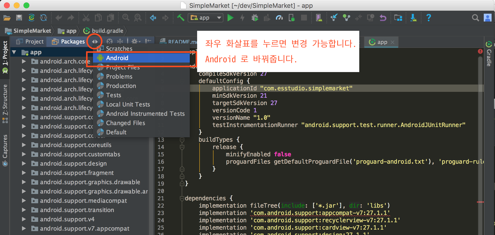

패키지 이름은 app 수준의 build.gradle 에서 찾을 수 있습니다.

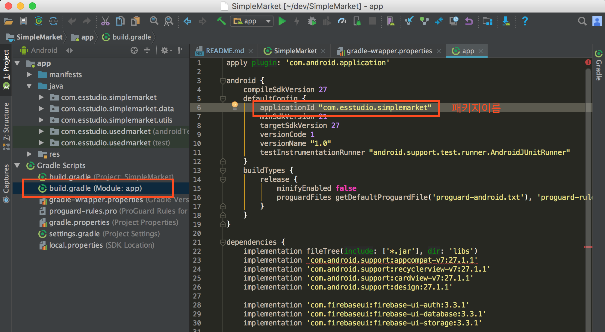

### SHA1 키 찾기

Firebase 의 인증기능을 사용하여 로그인을 구현하려면 SHA1 키가 필요합니다. 

##### Mac

```
$ keytool -exportcert -list -v -alias androiddebugkey -keystore ~/.android/debug.keystore
```

##### Windows

윈도우키 + R 을 누른후 "cmd" 라고 입력하면 검은색의 커맨드 입력 화면이 나옵니다.

```
c:\> keytool 
```

라고  쳤을 때 "명령을 찾을 수 없습니다." 라고 나오는 경우 keytool 이 설치된 경로를 찾아야합니다. 

keytool 은 JDK 라고 하는 Java SDK 폴더에 있는데 위치는 


```
1. C:\Program Files\Java\jdk?????\bin
2. C:\Program Files (x86)\Java\jdk?????\bin
(??? 는 설치된 JDK 버전에 따라 다릅니다.)
```

위 두 가지 경로 중 하나에 있습니다. 

"내 컴퓨터"를 열고 폴더를 직접 찾아가 봅니다. 

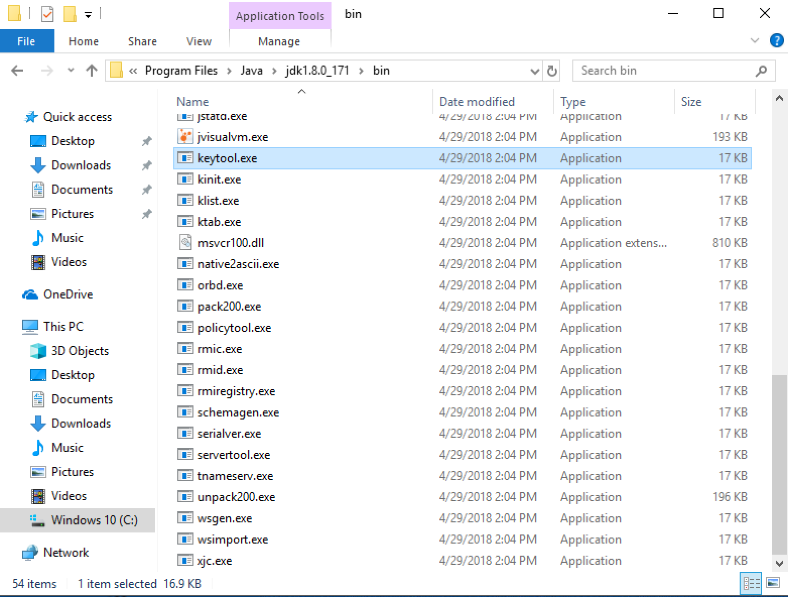


keytool 을 찾았으면 경로를 복사하고 cmd 창에 cd 명령과 함께 붙여 넣습니다.

```
C:\> cd C:\Program Files\Java\jdk?????\bin
```

이제 keytool 을 실행해 봅니다.

```
C:\Program Files\Java\jdk?????\bin> keytool
```

아래 스크린샷을 찹고하세요.

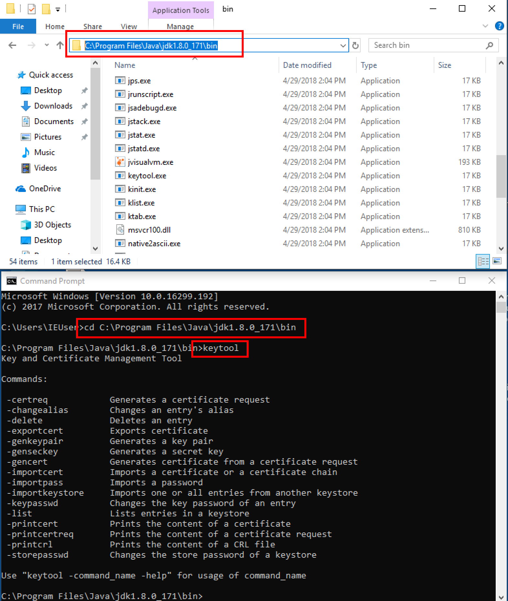


명령이 정상적으로 실행이 된다면 본래 입력할 명령을 입력해봅니다.

```
C:\Program Files\Java\jdk?????\bin> keytool -exportcert -list -v -alias androiddebugkey -keystore %USERPROFILE%\.android\debug.keystore
```


##### SHA1

아래의 화면과 같이 SHA1 을 찾아 Firebase 초기 설정화면에 입력합니다.

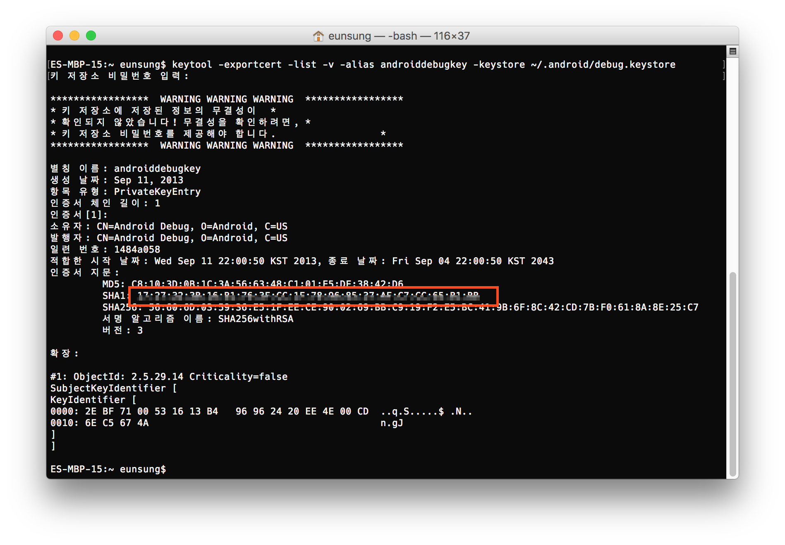


##### 참조 사이트

https://developers.google.com/android/guides/client-auth


### google-services.json 파일

아래의 화면과 같이 google-services.json 파일을 다운로드하고 app 폴더에 파일을 넣습니다.

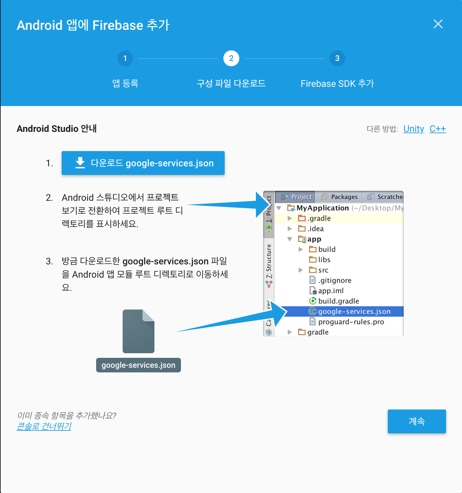

프로젝트 보기를 Project 로 바꿉니다.

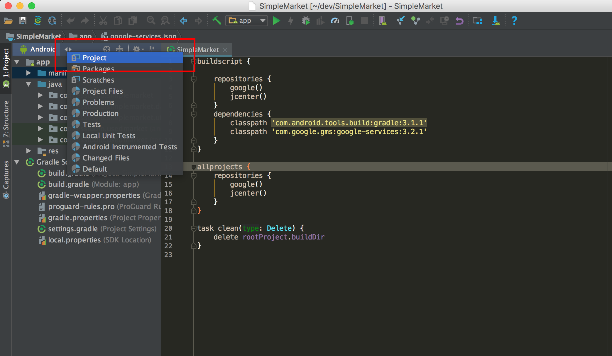

app 로 파일을 드래그하여 파일을 넣습니다.

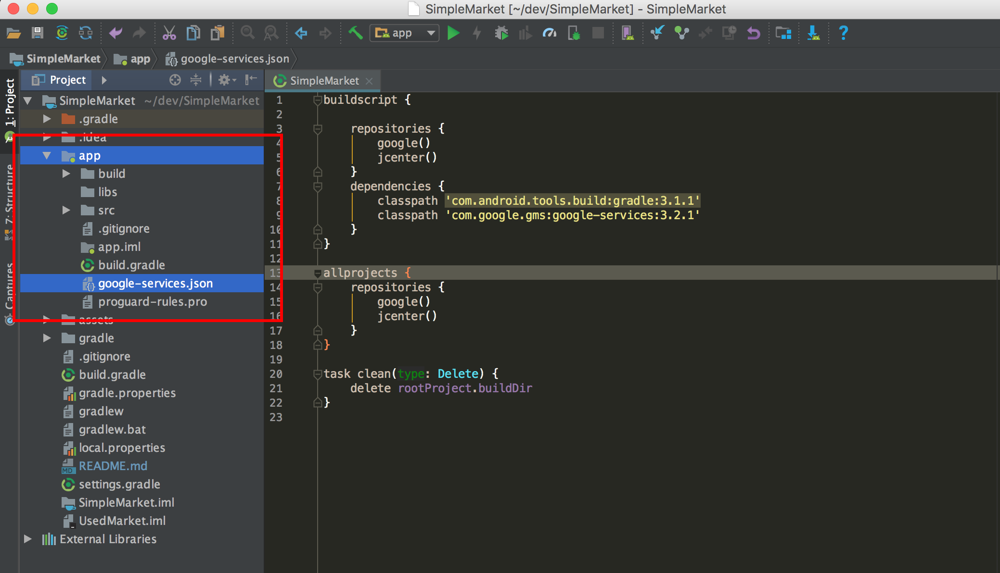


### Gradle 에 Firebase 설정 추가하기

Firebase 에서 제공하는 문서가 아직 업데이트 되지 않아 아래의 방법대로 따라하세요.

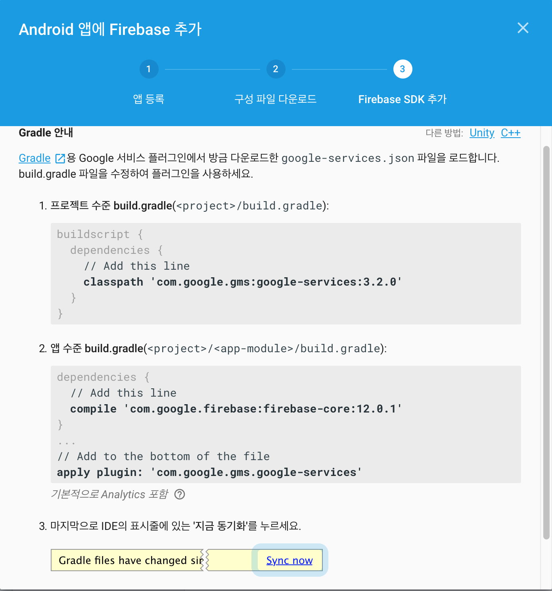


##### 프로젝트 수준의 build.gradle

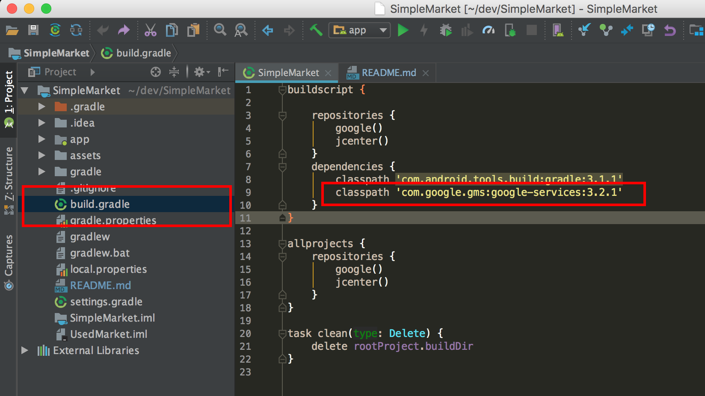


##### app 수준의 build.gradle

compile 'com.google.firebase:firebase-core:???' 를 다음과 같이 바꿔줍니다.

이 문서 하단에 dependencies 항목이 정리되어 있으니 참고 바랍니다.

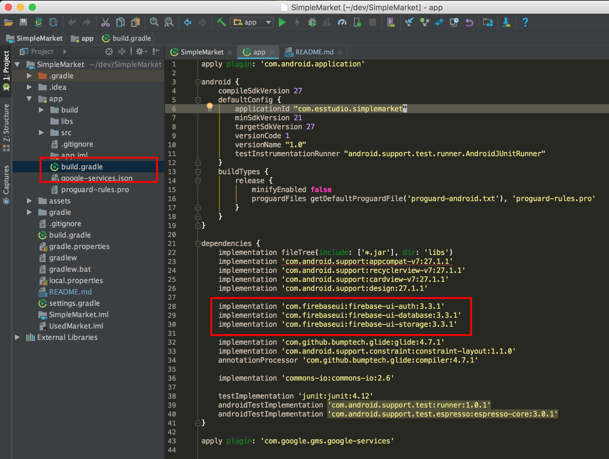


### Gradle sync

모든 작업이 완료되면 build.gradle 파일이 변경되었으므로 변경된 사항대로 프로젝트를 새롭게 동기화시켜주어야 합니다.

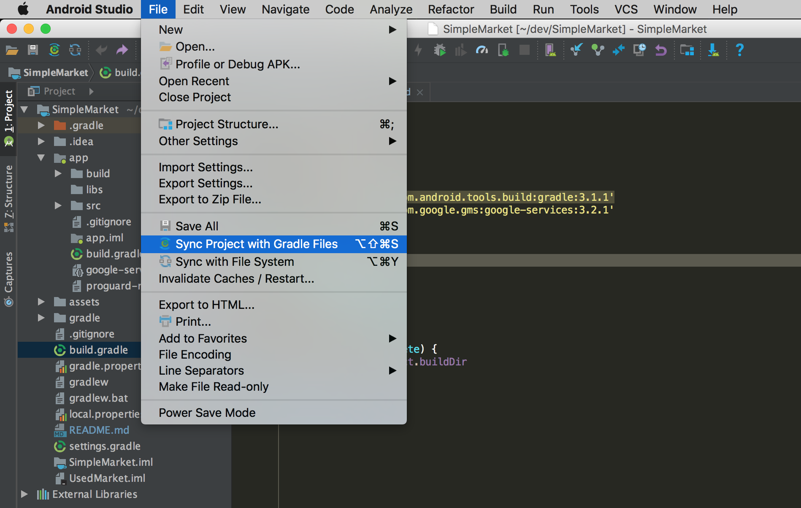

동기화가 오류 없이 완료되면 이제 Firebase 를 사용할 준비가 된겁니다.


# Dependencies

app 수준의 build.gradle 파일에 붙여 넣을 내용입니다.


```
// Google Libraries
implementation 'com.android.support:appcompat-v7:27.1.1'
implementation 'com.android.support:recyclerview-v7:27.1.1'
implementation 'com.android.support:cardview-v7:27.1.1'
implementation 'com.android.support:design:27.1.1'
implementation 'com.android.support.constraint:constraint-layout:1.1.0'

// Firebase UI
implementation 'com.firebaseui:firebase-ui-auth:3.3.1'
implementation 'com.firebaseui:firebase-ui-database:3.3.1'
implementation 'com.firebaseui:firebase-ui-storage:3.3.1'

// Image Loader
implementation 'com.github.bumptech.glide:glide:4.7.1'
annotationProcessor 'com.github.bumptech.glide:compiler:4.7.1'

// File IO
implementation 'commons-io:commons-io:2.6'
```

# License
MIT License
